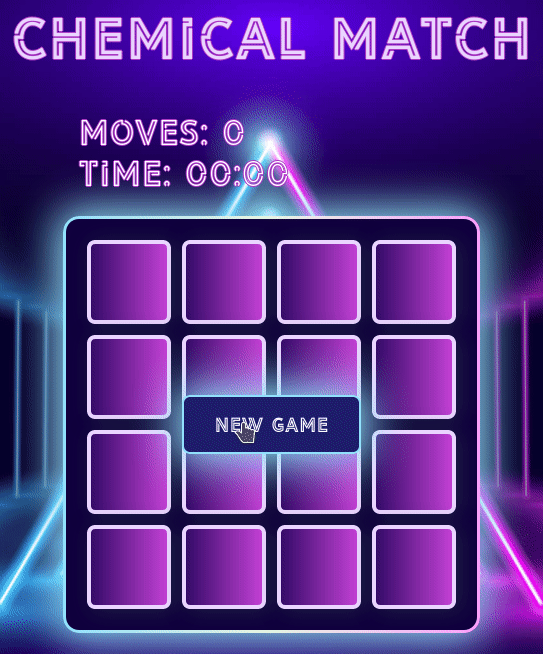

# Chemical Match

## Table of Contents
- [Description](#description)
- [Live](#live)
- [Design](#design)
- [Programming](#programming)
- [Libraries](#libraries)
- [Improvements](#improvements)
- [Tests](#tests)

## Description
*Chemical Match* is a classic memory game. The game revolves around finding matching cards. This project was developed within the frame of the *Front End Developer Nanodegree* program at *Udacity* and greatly improved afterwards.

## Live
For a live version of *Chemical Match*, visit [GitHub Pages](https://vibueno.github.io/chemicalmatch).

## Design
* Mobile first: the styles included in the file styles.css are optimized for a minimum width of 240px. The file responsiveness.css builds on styles.css by providing additional styles which make the site work correctly on bigger viewports.

## Programming
* Fully responsive (starting at 240px of *Unihertz Jelly Pro*, as fas as I know the smallest Smartphone widely available)
* Pseudoclassical pattern
* JavaScript Modules
* Event Delegation
* JavaScript Promises

### Style Guidelines
* [HTML](https://validator.w3.org)
* [CSS](http://udacity.github.io/frontend-nanodegree-styleguide/css.html)
* [CSS Rule order](https://9elements.com/css-rule-order)
* [JavaScript](http://udacity.github.io/frontend-nanodegree-styleguide/javascript.html)

### Validations
* [HTML (W3C)](https://validator.w3.org)
* [CSS (W3C)](https://jigsaw.w3.org/css-validator)
* [JavaScript (JSHint)](https://jshint.com)

## Libraries
No libraries have been used for this project. Only vanilla JS.

## Improvements
* High scores

## Tests
* Desktop computer + Developer Tools
* Uniherz Jelly Pro